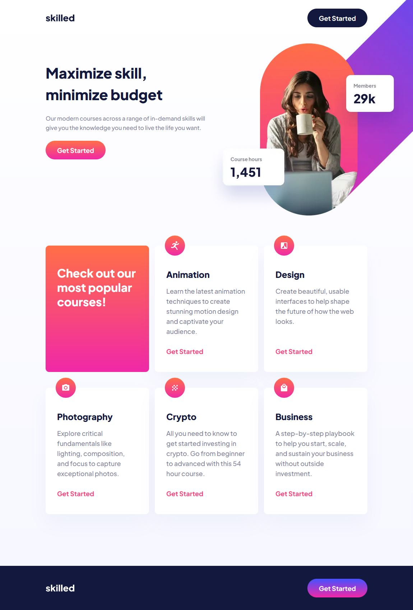
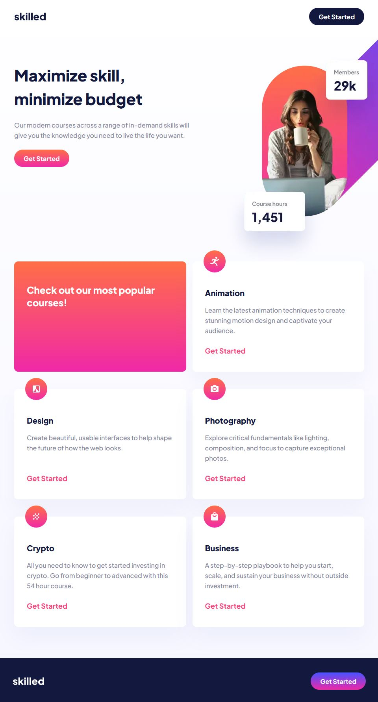

# Skilled e-learning landing page

This is a solution to the [Skilled e-learning landing page challenge on Frontend Mentor](https://www.frontendmentor.io/challenges/skilled-elearning-landing-page-S1ObDrZ8q). Frontend Mentor challenges help you improve your coding skills by building realistic projects.

## Table of contents

- [Skilled e-learning landing page](#skilled-e-learning-landing-page)
  - [Table of contents](#table-of-contents)
  - [Overview](#overview)
    - [The challenge](#the-challenge)
    - [Screenshots](#screenshots)
    - [Links](#links)
  - [My process](#my-process)
    - [Built with](#built-with)
  - [Author](#author)

## Overview

### The challenge

Users should be able to:

- View the optimal layout depending on their device's screen size
- See hover states for interactive elements

### Screenshots

### Links

- Solution URL: [https://github.com/tatasadi/skilled-e-learning-landing-page](https://github.com/tatasadi/skilled-e-learning-landing-page)
- Live Site URL: [https://skilled-e-learning-landing-page-ta.vercel.app](https://skilled-e-learning-landing-page-ta.vercel.app)

## My process

### Built with

- Semantic HTML5 markup
- Flexbox
- CSS Grid
- Mobile-first workflow
- [React](https://reactjs.org/) - JS library
- [Remix](https://remix.run/) - React framework
- [Tailwindcss](https://tailwindcss.com) - For styles

## Author

- Website - [Ehsan Tatasadi](https://ehsan.tatasadi.com)
- Frontend Mentor - [@tatasadi](https://www.frontendmentor.io/profile/tatasadi)
- GitHub - [@tatasadi](https://github.com/tatasadi)
- Linkedin - [Ehsan Tatasadi](https://www.linkedin.com/in/ehsan-tatasadi-2161a433)
- Twitter - [@etatasadi](https://twitter.com/etatasadi)
